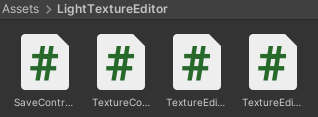
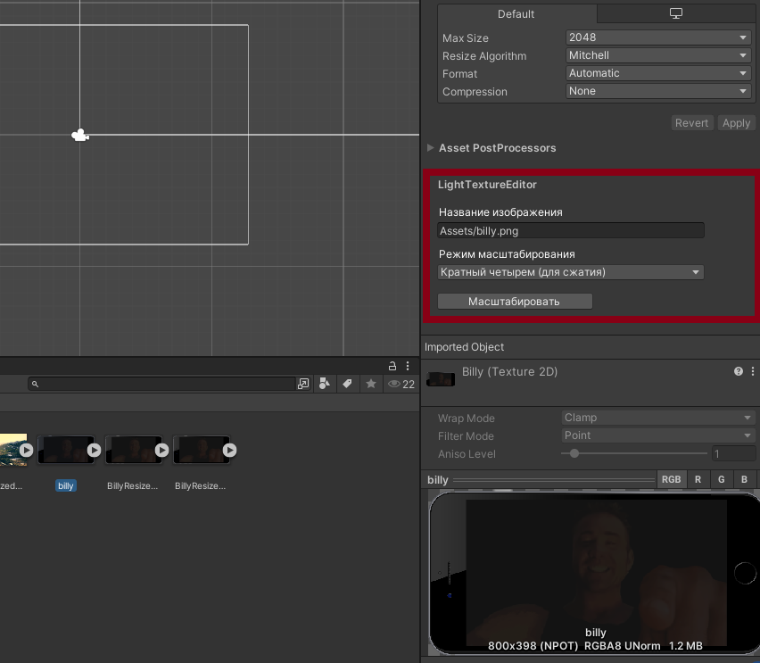
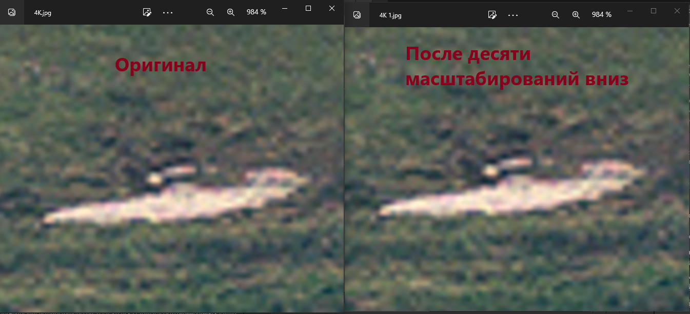

# LightTextureEditor

>Простой плагин для масштабирования ассетов изображений, с помощью средств Unity

### Лицензия
MIT. Создатель плагина не против безвозмездного использования и модификации продукта

### Важно!
По умолчанию плагин заменяет вашу текстуру на масштабированную с новыми значениями длины и ширины. 
Несмотря на проверку временем, рекомендуется не использовать плагин на ассетах, которые не сохранены нигде, кроме как эдитора Unity или без использования контроля версий.

### Решение подходит для:
- Корректировка размера текстур для поддержки сжатия (масштабирование длины и ширины до значений кратных четырем)
- Корректировка размера для генерации мип-карт
- Уменьшение размера текстур

### Руководство пользования:
1. Скачать и перенести папку *LightTextureEditor* в проект

    

2. После этого, при открытии окна инспектора для любого ассета типа текстуры, снизу в настройках появится окно плагина

    

3. На данный момент плагин поддерживает три основных режима редактирования текстур:

    Кратный четырем | Степень двойки | Кастомный размер  
    --- | --- | --- 
    Предназначен для приведения текстуры к масштабу, допускающему сжатие. Уменьшает размер ширины и высоты текстуры, так, чтобы оба эти параметра делились на 4  | Приведения текстуры к масштабу, допускающему автосоздание мип-карт. Приводит ширину и высоту текстуры к ближайшей степени двойки | Для установки пользовательской ширины и высоты текстуры

4. Проверить название текстуры и нажать кнопку *Масштабировать*

### Результаты масштабирования

В репозитории в папке Examples можно найти примеры текстур после десяти сжатий этим плагином

